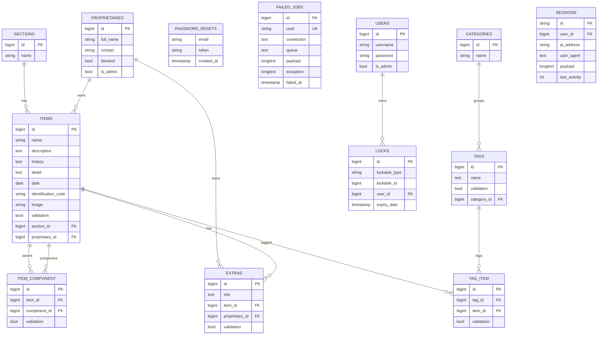

# Database model — v1 (Tankensho)

ER diagram from Laravel migrations in `e-museu-tankensho-primeira-versao-feita/database/migrations/`.

`created_at` and `updated_at` exist on most domain tables but are omitted here for readability.

## Notes

- `locks` uses a polymorphic relation (`lockable_type`, `lockable_id`).
- `item_component` is a self-relation on `items` (`item_id` → `component_id`).
- `password_resets`, `failed_jobs`, and `sessions` are Laravel infrastructure; no FK lines to domain tables except `sessions.user_id` → `users` (nullable index in migration).
