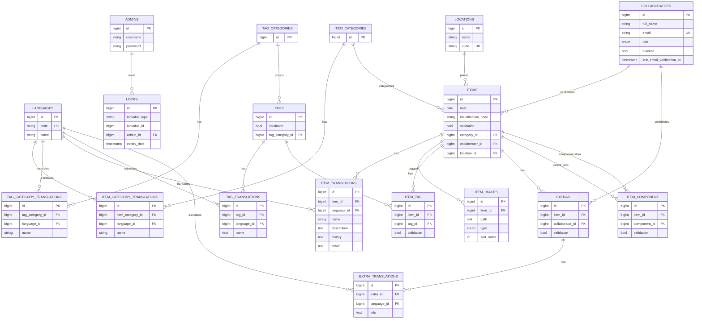

# Database Model (ER Diagram)

This diagram is generated from the current Laravel migrations under `database/migrations/`.

## Notes

- Translation tables enforce uniqueness per `(entity_id, language_id)`.
- `locks` uses a polymorphic relation (`lockable_type`, `lockable_id`).
- `item_component` is a self-relation on `items` (`item_id` -> `component_id`).
- Some foreign keys are nullable with `nullOnDelete()`, following migration rules.
